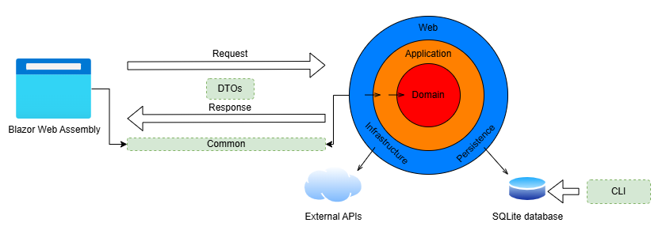
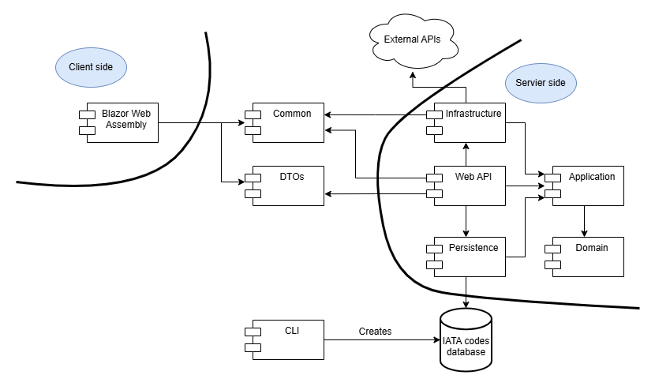
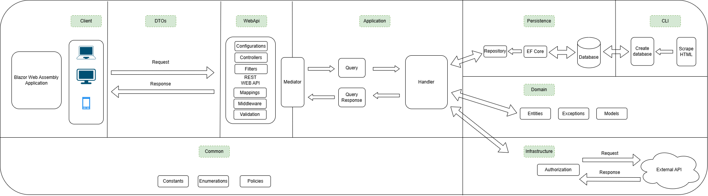
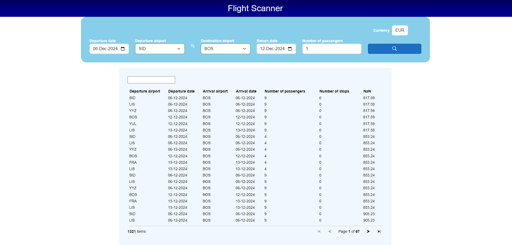
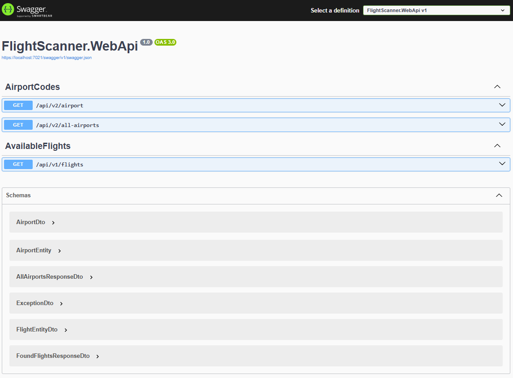

# Flight Scanner
Flight Scanner can be used to search for flights and look for available flights.

## Requirements
* [x] Use IATA airport codes from [Wikipedia](https://en.wikipedia.org/wiki/List_of_airports_by_IATA_code:_A)
* [x] Search flights from Amadeus service
    * [x] Use this data for searching of flights:
        - departure airport IATA code
        - departure date
        - destination airport IATA code
        - return date
        - number of passengers
        - currency
* [x] Display results to user
    * [x] Blazor Web Assembly
    * [x] Display this data for flights:
        - departure airport IATA code
        - departure date
        - destination airport IATA code
        - return date
        - number of stops
        - number of passengers
        - currency
        - price
* [x] Save retrieved data locally and send it in case of repeated search -> cache
- Additional work:
    - Enforce decoupling of different application logic to improve testability
    - Implement various middleware for APIs:
        - Validation of input parameters
        - Global exception handler middleware
        - Authentication middleware for one API
        - Filtering middleware for unwanted/invalid parameters
    - Write unit and integration tests for some of features
    - Add images for solution architecture, both for project dependencies and logical architecture
    - Add test coverage images
    - Add automation for build, format and test stages
    - Automate generation of SQlite database with IATA codes
    - Deploy Blazor Web Assembly client to GitHub pages: https://nizanixi.github.io/flight-scanner/

## Usage
Application is divided into two parts:
- server - all applicaion logic is contained decoupled from frontend display. This enables further expansion to other frontend technologies, like mobile.
- client - Blazor Web Assembly is selected for frontend technology.

**Note**: Before first usage, database with IATA codes needs to be generated. This can be done from CLI project or with by manually running GitHub action *create-database-from-cli-project.yml*. If created by GitHub action, download it from artifacts.

Start both server and client side projects. Server side project has Swagger just for demonstrational purposes. Select flight on client side and find your flight.

## Architecture

Onion architecture diagram

 

Project dependencies diagram

 

Logical architecture diagram

 

 

Project summaries:
- **CLI project** - scrapes data from Wikipedia page and exports it to database file. This is done since IATA codes sholdn't be taken from resource that almost everyone can edit. This database file can afterwards be used on server side of application.
    - CLI application has clean decoupling of input received from CLI UI and business logic, which enables good testability.
    - SQLite is used as database because of simlicity. There is no need for separate server installation, it's stored in single file which simplifies deployment and enhances it's portability. It also has support for Entity Framework which will afterwards be used as database manager.
- **Domain** - contains core business entities and models.
- **Persistence** - contains database related logic.
    - implements communication to SQLite database.
    - uses Repository pattern to decouple access to database from application logic.
- **Application** - contains CQRS implementation and interfaces for HTTP clients and repositories.
- **Web API** - handles incoming HTTP requests by controllers.
    - uses CQRS pattern for decoupling controllers from outer infrastructure code.
    - contains various filters, validators and middleware: 
        - validation of input IATA code, input currency code, date validators
        - URI disconitinuation filter
        - global exception handler
- **Blazor WA** - Blazor Web Assembly as frontend technology.
    - uses validators for input field in search form.
- **DTOs** - contains only DTOs for communication between client application (in this case Blazor Web Assembly) and backend Web APIs.
- **Common** - contains things required both for client and server side (constants and enums).
    - this project also includes Policies that are reused in cliend and server HTTP communication.
        - they should be in Infrastructure project to satisfy clean architecture requirements.
- **Infrastructure** - implements external API integrations.
    - contains DTO models for external APIs, which are held here to hide them for overusage in other layers.
    - caches user input for faster reuse of common requests.

## Client Web UI

Blazor Web Assembly User Interface

 

## Server APIs

Open API Documentation (Swagger)

 

## Tests
Below is test coverage from these 3 test projects:

Code Coverage for CLI project integration tests

 

Code Coverage for Web API project unit tests

 

Code Coverage for Web API project integration tests

 

## Possible improvements
- Use authentication between server and client projects
    - Add validation both to server and client side with FluentValidation
- Use HybridCache instead of IMemoryCache after uplifting to .NET9
- Add any kind of logger (Serilog)
- Raise test coverage
- Add deployment for backend server
- Use React as frontend technology