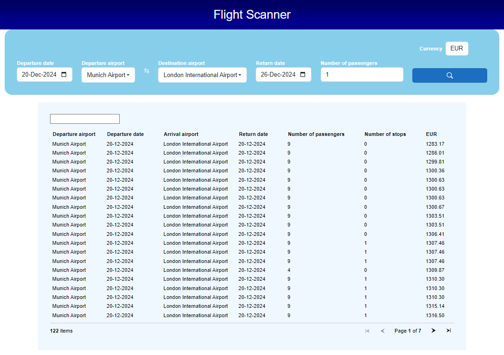

# Flight Scanner
Flight Scanner can be used to search for flights and look for available flights.

## Requirements
* [x] Use IATA airport codes from [Wikipedia](https://en.wikipedia.org/wiki/List_of_airports_by_IATA_code:_A)
* [x] Search flights from Amadeus service
    * [x] Use this data for searching of flights:
        - departure airport IATA code
        - departure date
        - destination airport IATA code
        - return date
        - number of passengers
        - currency
* [x] Display results to user
    * [x] Blazor Web Assembly
    * [x] Display this data for flights:
        - departure airport IATA code
        - departure date
        - destination airport IATA code
        - return date
        - number of stops
        - number of passengers
        - currency
        - price
* [x] Save retrieved data locally and send it in case of repeated search -> cache
- Additional work:
    - Enforce decoupling of different application logic to improve testability
    - Implement various middleware for APIs:
        - Validation of input parameters
        - Global exception handler middleware
        - Authentication middleware for one API
        - Filtering middleware for unwanted/invalid parameters
    - Write unit and integration tests for some of features
    - Add images for solution architecture, both for project dependencies and logical architecture
    - Add test coverage images
    - Add automation for build, format and test stages
    - Automate generation of SQlite database with IATA codes
    - Deploy Blazor Web Assembly client to GitHub pages: https://nizanixi.github.io/flight-scanner/

## Usage
Application is divided into two parts:
- server - all applicaion logic is contained decoupled from frontend display. This enables further expansion to other frontend technologies, like mobile.
- client - Blazor Web Assembly is selected for frontend technology.

**Note**: Before first usage, database with IATA codes needs to be generated. This can be done from CLI project or with by manually running GitHub action *create-database-from-cli-project.yml*. If created by GitHub action, download it from artifacts.

Start both server and client side projects. Server side project has Swagger just for demonstrational purposes. Select flight on client side and find your flight.

## Architecture
Architectural core concepts are expressed through logical diagram:

 

 

Project dependencies are expressed through diagram:

 

 

- **CLI project** - scrapes data from Wikipedia page and exports it to database file. This is done since IATA codes sholdn't be taken from resource that almost everyone can edit. This database file can afterwards be used on server side of application.
    - CLI application has clean decoupling of input received from CLI UI and business logic, which enables good testability.
    - SQLite is used as database because of simlicity. There is no need for separate server installation, it's stored in single file which simplifies deployment and enhances it's portability. It also has support for Entity Framework which will afterwards be used as database manager.
- **Domain** - contains entities and abstractions for business services.
- **Persistence** - implements communication to SQLite database.
    - implements Repository pattern to decouple access to database from application logic.
- **Application** - contains implementations for domain service abstractions, repositories, CQRS, caching, authentication of one exnternal API...
- **Web API** - used for communication with flight APIs by controllers, and for communication to client application.
    - uses CQRS pattern for decoupling controllers from outer infrastructure code.
    - uses Repository pattern for decoupling access to database.
    - contains various middleware: caching, validation of input IATA code, invalid request parameter to database filter, URI disconitinuation filter, global exception handler.
- **UI** - Blazor Web Assembly as frontend technology.
- **Shared** - contains only DTOs for communication between client application (in this case Blazor Web Assembly) and APIs.
- **Common** - contains things found both on client and server side (constants and enums)

## Client Web UI
Blazor Web Assembly User Interface:

 

 

## Server APIs
Open API Documentation (Swagger) is displayed below:

 

 

## Tests
Below is test coverage from these 3 test projects:

### Code Coverage for CLI project integration tests

 

### Code Coverage for Web API project unit tests

 

### Code Coverage for Web API project integration tests

 

## Possible improvements
- Use authentication between server and client projects
- Use HybridCache instead of IMemoryCache after uplifting to .NET9
- Add validation both to server and client side with FluentValidation
- Raise test coverage
- Enhance user experience by some Blazor control that supports virtualization
- Display wait indicator while search for flights is in progress